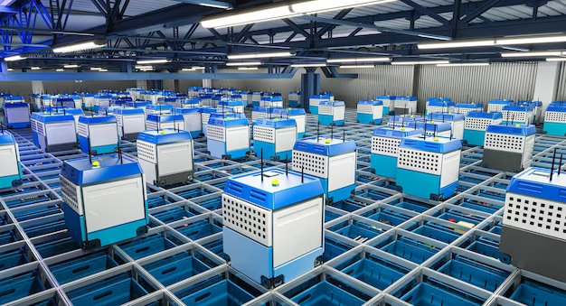

# Geautomatiseerd Magazijn

Dit project is een simulatie van een geautomatiseerd magazijn waarin robots bestellingen ophalen en voorraad aanvullen. De robots navigeren door een grid, vermijden obstakels en werken samen om taken efficiënt uit te voeren.



## 📌 Functionaliteiten

- **Robots** bewegen autonoom binnen het magazijn.
- **Orders** worden verwerkt door robots die voorraad ophalen en leveren.
- **Voorraadaanvulling** gebeurt automatisch als een cel een lage voorraad heeft.
- **Obstacle Detectie** voorkomt dat robots tegen elkaar of andere objecten botsen.
- **Dynamische Routebepaling** met BFS om paden te vinden.
- **Deadlock Vermijding** voorkomt dat robots oneindig vast blijven zitten.

## 🛠 Installatie

1. **Vereisten installeren**  
   Zorg ervoor dat je Python geïnstalleerd hebt. Installeer de benodigde pakketten:

   ```
   pip install -r requirements.txt
   ```

2. **Project starten Voer het script uit:**

   ```
   python src/main.py
   ```

## 🚀 Gebruik
- **Nieuwe Order**: Klik op de knop om een bestelling te plaatsen.
- **Aanvullen**: Laat een robot voorraad aanvullen bij een leverpunt.
- **Simulatie**: Observeer hoe de robots bewegen en taken uitvoeren.

## 🔧 Configuratie

**Pas instellingen aan in config.py:**

- **GRID_SIZE**: Afmetingen van het magazijn.
- **ROBOT_COUNT**: Aantal robots in de simulatie.
- **OBSTACLES**: Locaties van obstakels.

## 🛠 Technologieën
- **Python**
- **Tkinter** (voor de GUI)
- **BFS Algoritme** (voor pathfinding)


# Geautomatiseerd Magazijn

Dit project is een simulatie van een geautomatiseerd magazijn waarin robots bestellingen ophalen en voorraad aanvullen. De robots navigeren door een grid, vermijden obstakels en werken samen om taken efficiënt uit te voeren.

## ⚙️ Bekende Problemen en Oplossingen

### ❌ Robots blijven vastzitten  
**Oorzaak:** Twee robots proberen dezelfde route te nemen.  
**Oplossing:** Het algoritme bevat een "stuck-detectie" en zoekt een alternatieve route.  

### ❌ Robots kiezen geen optimale route  
**Oorzaak:** BFS kiest de eerste gevonden route.  
**Oplossing:** Overweeg A* voor slimmere routebepaling.  

## 📌 TODO / Verbeteringen

✅ Basisbeweging en ordersysteem  
✅ Deadlock-preventie toevoegen  
🔲 A*-pathfinding integreren  
🔲 UI verbeteren met robotstatussen  
🔲 Obstacle-detectie optimaliseren  

## 📝 Licentie  

Dit project is open-source en kan vrij worden gebruikt en aangepast.  
